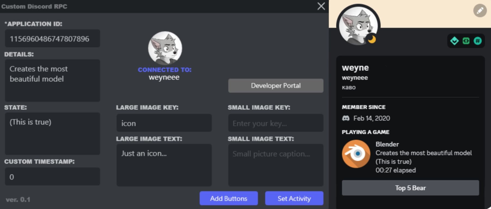

# Discord Custom RPC Panel
Panel for setting custom RPC for the Discord client. Supports adding buttons, 
time, images and text to the "Playing a game" status.

 

   

## Usage

### Creating an apllication

To create a game that we will "play" we need to create an application
on the Discord Developer Portal. 

1. Run the panel and click "Developer Portal" button (or click [here](https://discord.com/developers/applications)).
2. Here you need to login your Discord account and click "New Application".
   Write a name for the app. It will be used as name of the game
   in status (you can change it at any time).

 

   

3. Copy `Application ID` and paste into the first field in the panel.
   Now the panel will work with **your app name** and **icons**!
 

   

### Adding Icons

1. Go to [Discord Developer Portal](https://discord.com/developers/applications), select your app.
   Open the "Rich Presence" tab. On this page add images in the "Rich Presence Assets" section.
   Each image must be assigned its own key (write any value convenient for you).
   **Note:** Discord doesn't load icons right away. You may have to wait a few minutes 
   before the icons are saves and you can use them.
   
 

   

2. Copy your image key and paste into the appropriate fields. Add text to the fields below 
   the keys ─ it will appear on cursor hover. `Large image` ─ the main big image, `Small image` 
   ─ small image on the right side (optional).

### Adding buttons

Click "Add Buttons" button on the panel. Now you can set text and links for buttons!
**Note:** Links must work for the buttons to appear.
 

   

### Usage custom timestamps

By default, the game time in status starts from `0:00`, but `Custom timestamp` field can change it.
Field accepts a Unix numeric value. You can use [generator](https://www.unixtimestamp.com/) to set a custom time. It's fun :D

## Conclusion

This is my first C# project. The panel was created with the purpose
check my capabilities and create something useful for someone... :)
